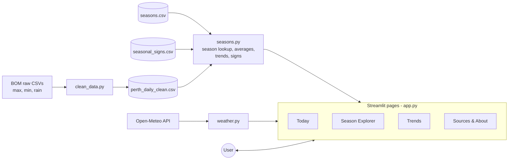

# Six Seasons Perth

An interactive web app that helps visitors, students and anyone new to Perth learn about the
six Noongar seasons. It shows what season it is today using live weather, explains each season and
its plants and animals, and analyses 80 years of Perth weather to see how each season is changing.

**Live app:** https://six-seasons-app-awbfbytcjbwthdz4aknk9w.streamlit.app/
**Team:** SAM DAY + SOL MANNERS · CITS1501, UWA, 2026

## Features
- **Today:** the current Noongar season (Perth time) with live weather from Open-Meteo
- **Season Explorer:** six interactive seasons (hover for a summary, click for details, average weather
  and seasonal plants/animals), a season wheel comparing Noongar and European seasons, and a chart of recorded species
- **Trends:** pick a season and a measure to see change since 1945, with a hand-written line of best fit
- **Sources & About:** data sources, licences, data preparation and privacy

## Install and run
```
git clone https://github.com/samnday-debug/six-seasons-app.git
cd six-seasons-app
python3 -m venv .venv
source .venv/bin/activate        # Windows: .venv\Scripts\activate
pip install -r requirements.txt pytest
streamlit run app.py
```

## Run the tests
```
python -m pytest -v
```
22 automated tests cover the main functions, the season algorithm, boundary dates,
invalid input and the app's behaviour when live weather is unavailable.

## Rebuild the cleaned data (optional)
```
python clean_data.py
```
Merges the three raw BOM files into `data/perth_daily_clean.csv`.

## Project structure
| File | Purpose |
|---|---|
| `app.py` | Navigation between the four pages |
| `views/` | One file per page (today, explorer, trends, sources) |
| `seasons.py` | Core logic: season lookup, grouping, averages, trend calculation |
| `weather.py` | Fetches live weather from Open-Meteo, returns `None` on failure |
| `clean_data.py` | Cleans and merges the raw BOM data |
| `data/` | Raw and cleaned weather data, season info, seasonal signs |
| `tests/` | Automated tests (pytest) |

## Architecture


## Data sources
- Bureau of Meteorology, Climate Data Online: Perth Airport (009021) daily max/min temperature and rainfall
- Open-Meteo forecast API (live weather)
- Seasonal knowledge: Bureau of Meteorology Nyoongar calendar; City of Stirling; Marine Waters (DPIRD) Noongar Six Seasons fact sheet; Noongar Boodjar Language Cultural Aboriginal Corporation (full links on the Sources & About page)

## Security and privacy
No personal data is collected, there are no logins, and no API keys or passwords are used or stored.
User input is limited to dropdowns, a date-range slider and buttons, and is validated before use.